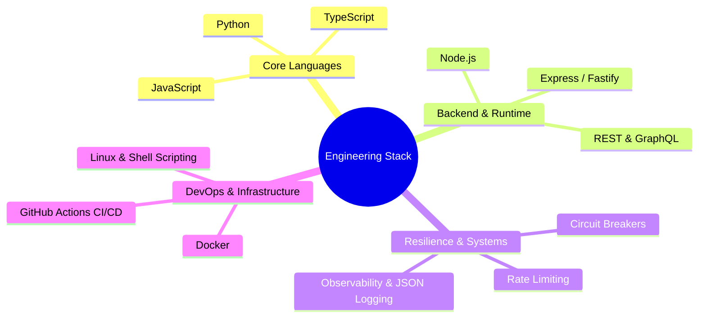

# Hi there, I'm Sameer 👋

### ⚡ Software Engineer & Open-Source Contributor

*Engineering resilient distributed systems, modern developer tooling, and high-performance cloud architectures.*

  
  
  

---

### 🏆 GitHub Achievements & Trophies

  

---

### 🚀 Featured Open Source Work

<table>
  <tr>
    <td width="50%">
      <h3 align="center"><a href="https://github.com/s4meer-dev/blehhh">blehh ⚡</a></h3>
      

        <b>Ultra-lightweight resilience & fault-tolerance toolkit for TypeScript and Node.js.</b> 
        Zero-dependency implementations of Circuit Breakers, Exponential Backoff with Jitter, Sliding Window Rate Limiting, and Liveness Probe Registries.
      

      

        
        
        
      

    </td>
  </tr>
</table>

---

### 🛠️ Languages & Ecosystem

 

---

### 📊 Contribution Metrics

  
  

  

---

  <i>"With the flow of the wind ~~"</i>

